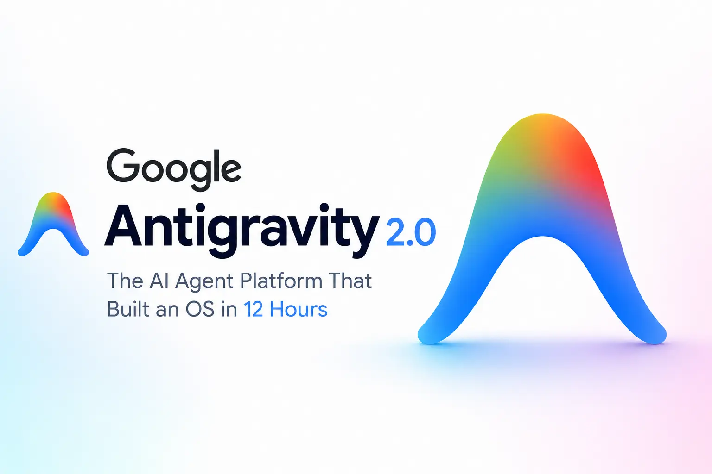
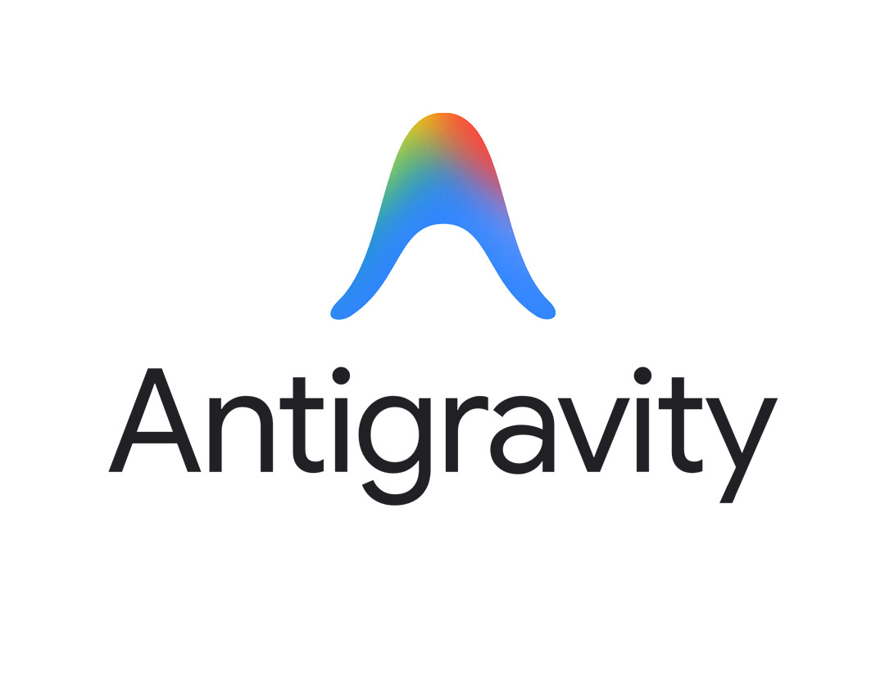
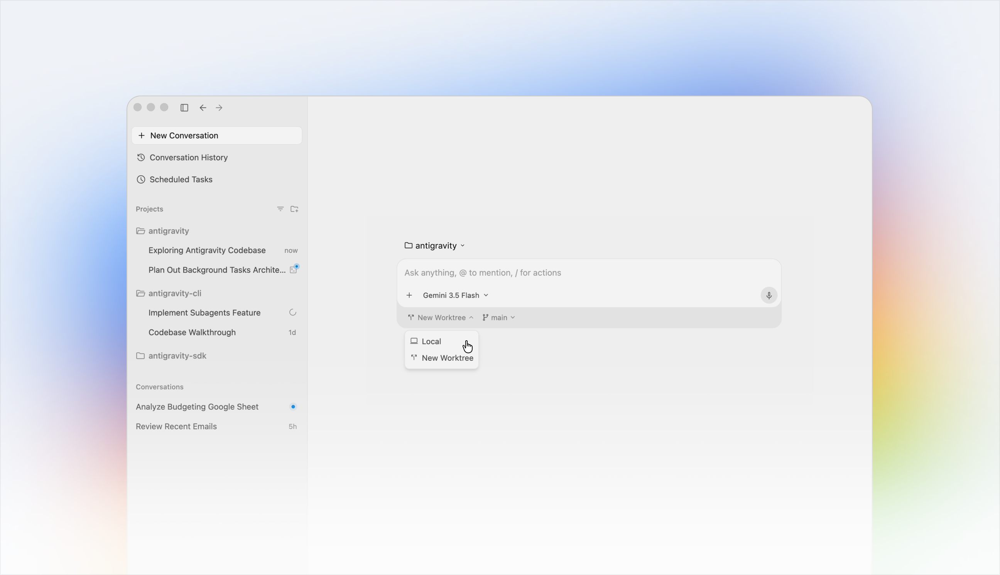
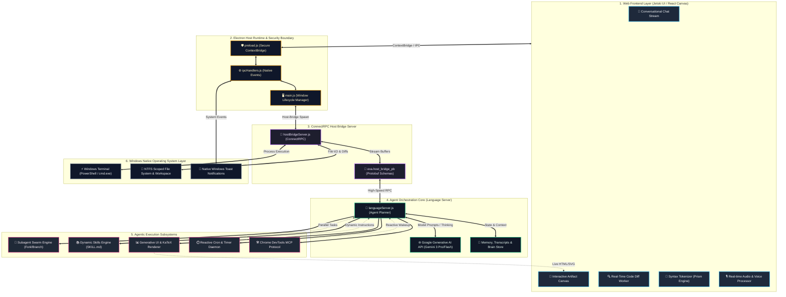
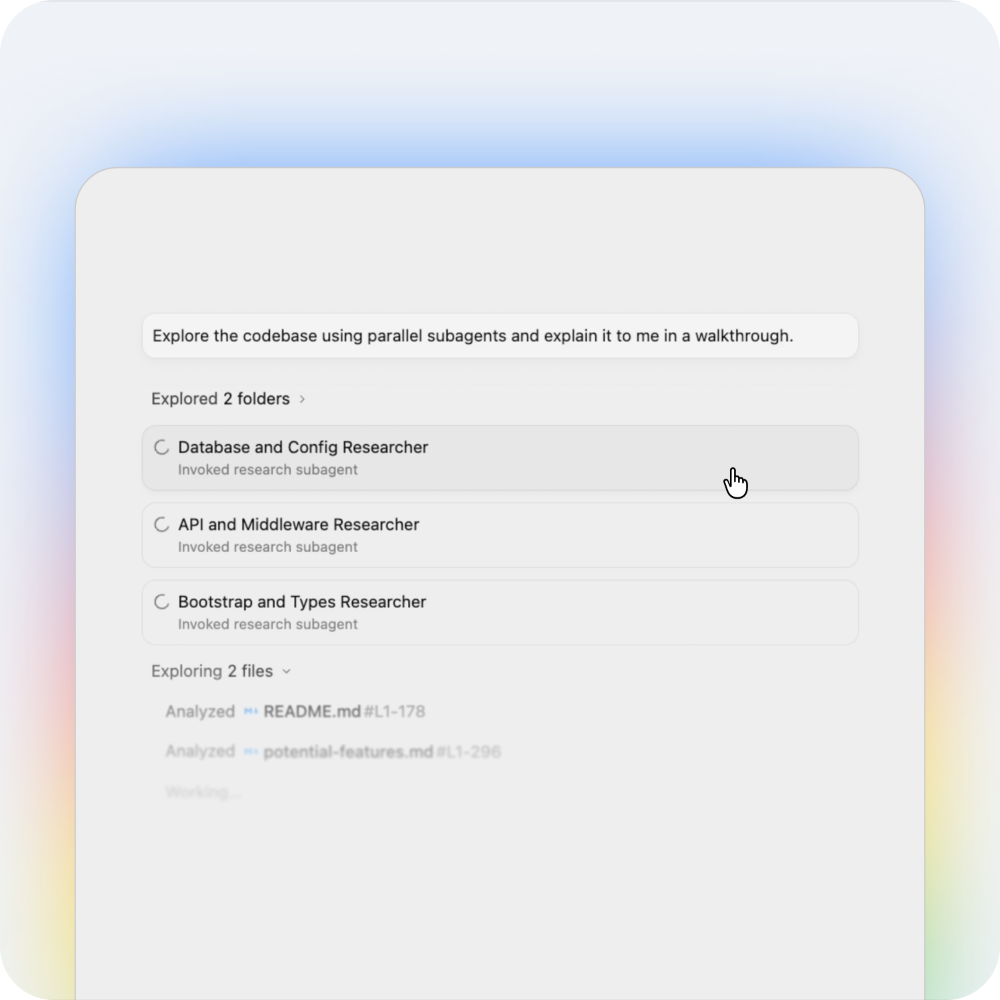
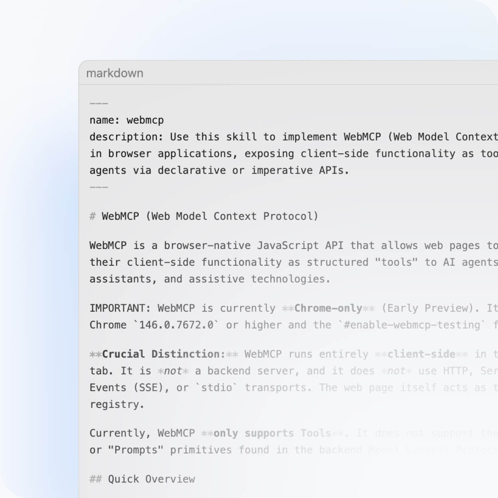
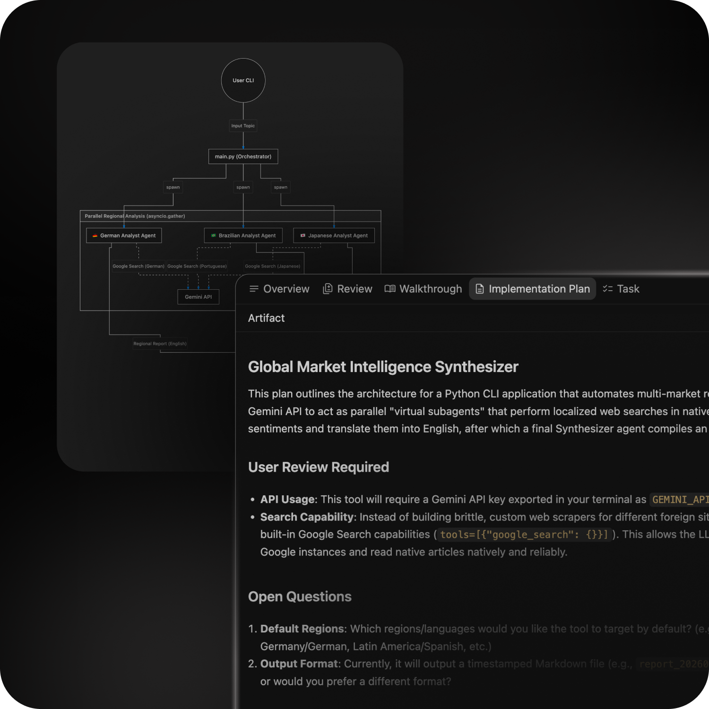
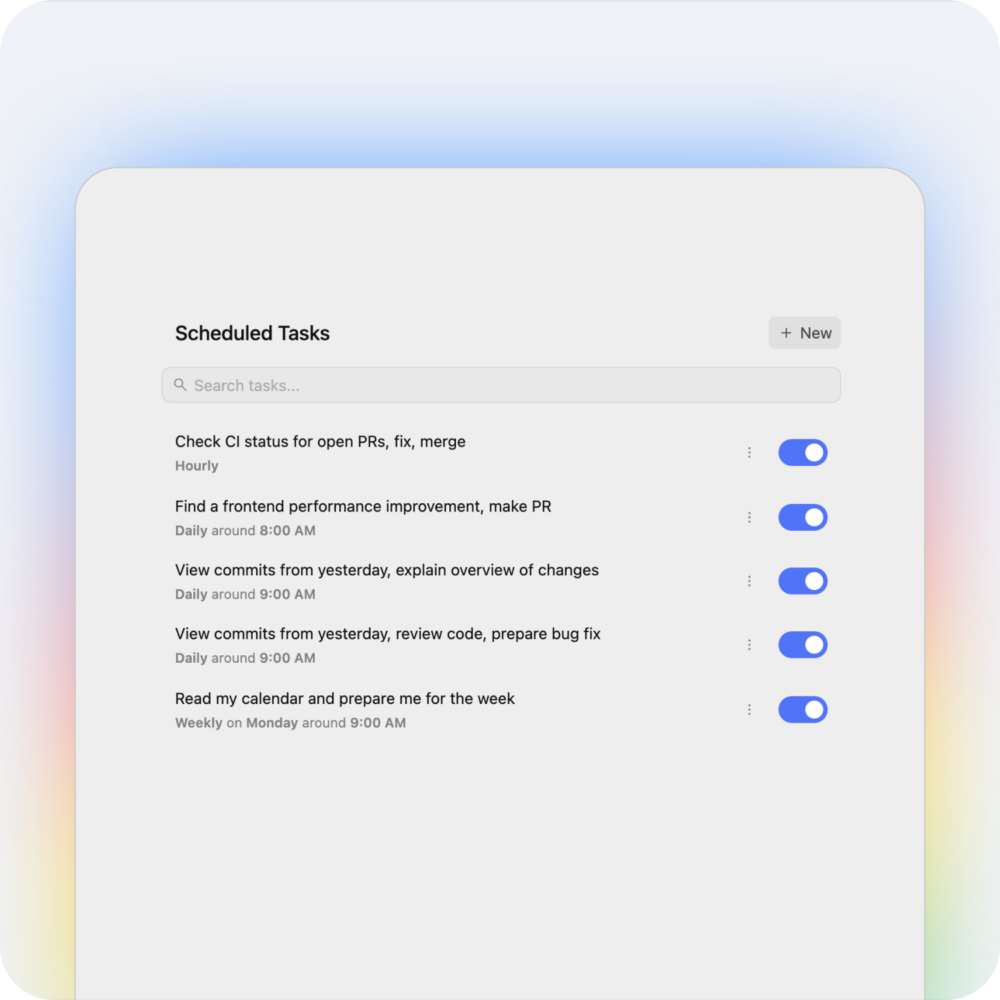

<p align="center">
  
</p>

<p align="center">
  
</p>

<h1 align="center">Google Antigravity 2.0</h1>

<p align="center">
  <strong>The Next-Generation Agentic AI Software Engineering Environment for Windows</strong><br/>
  <em>Powered by Google DeepMind's Gemini Models, Autonomous Subagent Swarms, Extensible Skills, and High-Throughput ConnectRPC Host Architecture.</em>
</p>

<p align="center">
  <a href="https://antigravity.google"></a>
  <a href="package.json"></a>
  
  
  
</p>

<p align="center">
  
</p>

---

## 🎬 Platform Demonstration Video

Watch Google Antigravity 2.0 in action executing real-time autonomous pair programming, multi-agent delegation, and rich artifact synthesis:

https://github.com/user-attachments/assets/efff0472-f5ec-47eb-b6f1-4fcf55470455

---

## 🌟 Overview: What is Antigravity 2.0?

**Google Antigravity 2.0** is an enterprise-grade agentic coding assistant built from the ground up by Google DeepMind. Unlike conventional autocomplete or chat-box assistants, Antigravity functions as a full-fledged autonomous pair-programmer operating directly inside your local environment.

It inspects file trees, executes system commands via native PowerShell/Bash terminals, plans complex multi-step refactors, delegates tasks to parallel subagent swarms, renders real-time interactive UI widgets (Artifacts), and maintains continuous background scheduled jobs without manual polling.

---

## 🏗️ Master System Architecture

Below is the **Master End-to-End System Architecture Diagram** of Google Antigravity 2.0 for Windows, illustrating how user inputs flow from the React frontend, through the Electron security boundary and ConnectRPC daemon, into the agent reasoning loop and native OS subsystems:



---

## 🔍 Comprehensive Architecture & Functional Explanation

Every component in the architecture above is engineered for modularity, strict security isolation, and ultra-low latency:

### 1. Web Frontend Layer (`web_frontend/`)
- **Conversational Chat Stream (`main.js` / React Canvas):** Renders streaming markdown text, code blocks, diff inspectors, and tool invocation cards in real-time.
- **Interactive Artifact Canvas:** Dedicated side-by-side rendering container for standalone web applications, live Mermaid diagrams, SVG mockups, and KaTeX math formulas.
- **Real-Time Code Diff Worker (`diff_worker.js`):** Runs syntax comparisons in an isolated WebWorker thread to compute line-by-line diffs without freezing the UI thread.
- **Syntax Tokenizer (`prism_bundle.js`):** High-speed syntax coloring across 50+ programming languages.
- **Audio & Voice Processor (`audio_processor.js`):** Handles microphone capture, noise suppression, and real-time audio streaming for direct voice control.

### 2. Electron Host Runtime & Security Boundary (`electron/`)
- **Secure ContextBridge (`preload.js`):** Enforces Chromium process isolation. Only strictly whitelisted and typed API methods are exposed to the DOM window; raw Node.js primitives cannot be accessed by web scripts.
- **Native IPC Handlers (`ipcHandlers.js`):** Routes native OS requests (file picker dialogs, window minimization, persistent settings, clipboard access) safely between renderer and main processes.
- **Window Lifecycle Manager (`main.js`):** Boots the Electron container, manages multi-monitor scaling, handles hot updates (`electron-updater`), and spawns the background ConnectRPC daemon.

### 3. ConnectRPC Host Bridge Server (`electron/hostBridgeServer.js`)
- **Microservice Architecture:** Utilizes `@connectrpc/connect` and `@connectrpc/connect-node` over standard HTTP/2 and IPC protocols, decoupling the language model backend from Electron UI code.
- **Protobuf Schemas (`exa.host_bridge_pb`):** Strict binary schema definitions guaranteeing type safety for tool inputs, command outputs, file reading, and real-time streaming chunks.

### 4. Agent Orchestration Core (`electron/languageServer.js`)
- **Language Server Planner:** Implements the core agent loop. Receives user goals, synthesizes step-by-step execution plans, inspects environment state, and dispatches tool calls.
- **Google Generative AI Connection:** Interfaces directly with Google DeepMind's flagship Gemini models (`https://generativelanguage.googleapis.com`) using structured JSON function-calling and multimodal tokens.
- **Persistent Brain Store (`brain/<id>/`):** Writes persistent JSONL step transcripts, error logs, task records, and scratchpad data to disk, allowing sessions to resume seamlessly across reboots.

### 5. Autonomous Execution Subsystems
- **Subagent Swarm Engine (`invoke_subagent`, `define_subagent`):** Allows the primary agent to spawn specialized background subagents (e.g., Codebase Researcher, Database Debugger) running in isolated conversation contexts or branched git workspaces.
- **Dynamic Skills Engine:** Dynamically discovers and loads specialized capability packages (`SKILL.md`) based on context (scientific APIs, Android reverse engineering, UI styling, etc.) without inflating the base prompt.
- **Generative UI & Artifacts Engine:** Generates and updates standalone `.html`, `.svg`, and `.md` documents with automatic versioning, live hot-reloading, and embedded previews.
- **Reactive Scheduler Daemon (`schedule`):** Built-in cron schedule and one-shot timer system that supports conditional wakeups (`never`, `any`, or specific sender task IDs) without requiring CPU-heavy busy loops.
- **Chrome DevTools MCP Server (`chrome-devtools-mcp`):** Connects to headless browser sessions via the Model Context Protocol (MCP) for automated web browsing, DOM testing, and visual QA.

### 6. Windows Native Operating System Layer
- **Windows Terminal Integrations:** Spawns asynchronous child processes via PowerShell or CMD, streaming standard output, error codes, and signals reactively.
- **NTFS File System & Workspace:** Direct access to Windows drive paths, symbolic links, file modification listeners, and git repositories.
- **Native Toast Notifications:** Alerts developers when long-running background tasks, subagents, or test suites finish execution.

---

## 🚀 Core Pillars & Visual Feature Tour

### 🤖 1. Autonomous Multi-Agent Swarms (Subagents)
<p align="center">
  
</p>
Break down complex epics into concurrent sub-tasks. Spawn read-only research agents, dedicated unit-test runners, or code refactorers. Subagents report back reactively with full transcripts and isolated git workspaces.

---

### 🧠 2. Dynamic Skills & Extensible Tooling
<p align="center">
  
</p>
Extend Antigravity's capabilities on the fly. Each skill contains specialized workflow scripts, domain documentation, and API clients that activate dynamically only when relevant to your prompt.

---

### 🎨 3. Interactive Generative UI & Artifacts
<p align="center">
  
</p>
Review rich, multi-file deliverables in an interactive canvas. Inspect diffs, test executable HTML/CSS/JS mockups, review comprehensive markdown reports, and render LaTeX formulas with zero context clutter.

---

### ⏱️ 4. Reactive Background Scheduling & Cron Tasks
<p align="center">
  
</p>
Configure recurring cron schedules or one-shot timers directly from conversation. Monitor server deployments, poll pull requests, or automate maintenance tasks without active chat intervention.

---

## 📁 Repository Structure

```text
Antigravity_2.0_Windows/
├── assets/                         <-- High-Resolution Media Assets & Demonstration Video
│   ├── AGY2-Wide.jpg               <-- Official Platform Wide Banner
│   ├── antigravity-google-ai-logo.jpg <-- Google AI Branding Logo
│   ├── google-antigravity.webp     <-- High-Res App Icon
│   ├── hero-middle-gradient.png    <-- Application UI Hero Showcase
│   ├── artifacts.png               <-- Generative UI & Artifacts Illustration
│   ├── scheduled.png               <-- Task Scheduling & Cron Engine Screenshot
│   ├── skills.jpg                  <-- Dynamic Skills Engine Showcase
│   ├── subagents.png               <-- Multi-Agent Swarm Orchestration Screenshot
│   └── Google Antigravity - Antigravity 2.0.mp4 <-- Full 60fps HD Demonstration Video
│
├── electron/                       <-- Native Host Runtime & Microservice Bridge
│   ├── main.js                     <-- Window lifecycle, update checker & LS launcher
│   ├── languageServer.js           <-- Agent reasoning loop & Gemini API integration
│   ├── preload.js                  <-- Hardened ContextBridge security boundary
│   ├── ipcHandlers.js              <-- Native OS IPC event router
│   ├── hostBridgeServer.js         <-- ConnectRPC daemon bridging OS and agent
│   └── proto/                      <-- Protobuf definitions for HostBridgeService
│
├── web_frontend/                   <-- Complete React Web Application (Jetski Web)
│   ├── index.html                  <-- Main HTML entry point
│   ├── main.js                     <-- Core React UI bundle & chat canvas
│   ├── compiled_tailwind.css       <-- Tailwind CSS styling & responsive classes
│   ├── jetbox.css                  <-- Antigravity dark/light design system styles
│   ├── diff_worker.js              <-- Isolated WebWorker code diff engine
│   ├── prism_bundle.js             <-- Syntax highlighting bundle
│   ├── audio_processor.js          <-- Real-time audio & voice engine
│   └── symbols-icons/              <-- Vector icons & filetype glyphs
│
├── chrome-devtools-mcp/            <-- Chrome DevTools MCP (Model Context Protocol) Server
├── assets/                         <-- High-resolution visual diagrams & demo media
├── package.json                    <-- Application dependencies & RPC specifications
└── README.md                       <-- Master Comprehensive Documentation
```

---

## 🛠️ Technical Specifications

| Component | Technology | Specification / Version |
| :--- | :--- | :--- |
| **Product Version** | Google Antigravity | `v2.19.1` (Build 2026.x) |
| **Target OS** | Microsoft Windows | Windows 11 / Windows 10 (64-bit / ARM64) |
| **Host Framework** | Electron | Node.js v20+ / Chromium Embedded |
| **Frontend Framework** | React 18+ | Jetski Web, Tailwind CSS, Jetbox UI Tokens |
| **RPC & Interop** | ConnectRPC | `@connectrpc/connect` v2.1.2 & `@bufbuild/protobuf` |
| **Model Engine** | Google DeepMind | Gemini 3 Pro / Gemini 3 Flash Multimodal |
| **Terminal Integration**| Windows Shell | PowerShell 7+ / Windows PowerShell 5.1 / CMD |
| **Tool Protocols** | MCP & Native RPC | Model Context Protocol (`chrome-devtools-mcp`) |

---

## 🚀 Getting Started & Developer Setup

### Prerequisites
- **Node.js**: `v20.x` or higher
- **Package Manager**: `npm` or `yarn`
- **Operating System**: Windows 10/11 (64-bit)

### Installation
```powershell
# 1. Clone the repository
git clone https://github.com/smartworldarafath/Antigravity_2.0_Windows.git
cd Antigravity_2.0_Windows

# 2. Install dependencies
npm install

# 3. Start development server & Electron host
npm run start
```

---

## 📄 License & Attribution

This repository is maintained by **smartworldarafath** for research, analysis, and custom tool development based on Google Antigravity 2.0. Distributed under the [MIT License](LICENSE).

&copy; 2026 Google LLC & Google DeepMind. Antigravity and the Antigravity logo are trademarks of Google LLC.
